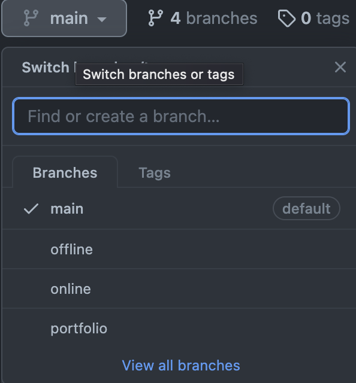

# SubUx Python kursi.

## Kurs haqida:

* Kursdagi video darsliklar faqatgina <a href="https://t.me/subux/">SUBUX</a> orqali sotuvga chiqariladi.

* Har bir video darsdan so'ng alohida uyga vazifa tayyorlangan bo'lib ularni faqatgina <a href="https://t.me/subux/">SUBUX</a> tomonidan tavsiya etilgan kuratorlar tekshirishi mumkin. Kursimizni faqat o'zimizdan sotib oling(clounlardan sotib olingan kurs uchun SUSYS jamoasi javobgar emas!!!).

* Bizning video kurslarimizni tarqatish taqiqlanadi. Va shu sababli barcha darslar telegramda yopiq guruhda olib boriladi.

* Kursdan so'ng barcha vazifa va portfolioni to'liq bajargan o'quvchilarimiz sertifikat taqdim etiladi. Va ularni ro'yxatga olish maqsadida (Shaxsni tasdiqlovchi hujjatlar talab e'tiladi).

* Darsliklar va portfoliolar ro'yxati bilan yuqoridagi branchlar oqali tanishishingiz mumkin.

## Kursga qatnashish uchun nimalar talab etiladi:

* Kompyuter savodxonligi.

* 12 yoshdan katta bo'lishi.

* Sertifikat va ro'yxatdan o'tish uchun shaxsni tasdiqlovchi hujjat.

* Doimiy internet.

* Oylik to'lov(yoki kelishuv asosida bir martalik to'lov).

### Ro'yxatdan o'tish uchun <a href="https://t.me/subux/">SUBUX</a> bilan bog'laning!
